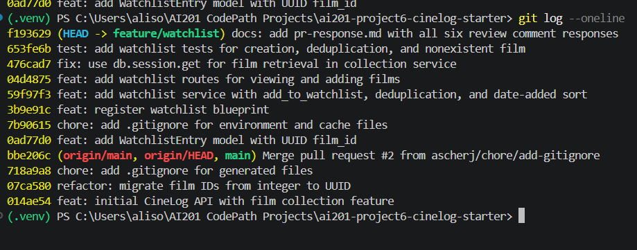

# PR Response Doc — CineLog Watchlist Feature

## AI Usage
I used AI (Claude) throughout this project as a step-by-step guide for git/GitHub workflow — particularly for resolving rebase conflicts (the models.py UUID conflict in Comment 6) and rebuilding commit history in Milestone 4 after running into issues with the Vim rebase editor. I did not use AI to write the actual watchlist logic (the rename, deduplication check, or route implementation) — those were written by hand based on studying the equivalent patterns in collection_service.py and test_collection.py.
## Comment 1 — Rename
**What I did:** renamed the function save_to_watchlist() to add_to_watchlist
**How I verified:** checked for any save_to_watchlist left unedited. changed them to add_to_watchlist. Confirmed tests worked

## Comment 2 — Deduplication
**What I did:** Added the Already in watchlist error exception. added the dedup check to add_to_watchlist()
**How I verified:** ran pytest tests/ -v, all were passing

## Comment 3 — Missing test
**What I did:** created tests/test_watchlist.py followed the same fixture as the collection.py
**How I verified:** I confirmed that all three tests passed. 

## Comment 4 — Default visibility
**My position:** Change the default to False
**Reasoning:** Watch lists show a person's intent or interests. Because watchlists can contain more personal information of the user to other users, I recommend keeping the default at false. This way the user has a choice to make it public and its intentional they want this information public. 
**Tradeoff acknowledged:** This could limit the social value. This could mean many watchlists are on private, which coupd supress the value of the product. 

## Comment 5 — Sort order
**My position:** switched watchlist sort order from alphabetical to date order. 
**Reasoning:** Most users would want to see what was recently added without having to scroll. This would match with get collection which already sorts by date. 
**Engagement with reviewer's point:** I agree, the user would want to see what was recently added. In a watchlist, it is popular for the list to be in date order. I implemented the suggestion

## Comment 6 — Rebase
**What conflicted:** models.py conflicted because the watchlist entry needed to be updated form db.Integer to db.String(36)
**How I resolved it:** Updated `WatchlistEntry.film_id` to `db.String(36)` with the same `db.ForeignKey("film.id")` reference as `CollectionEntry`, keeping the rest of the model unchanged. Also added a `UniqueConstraint` on `(user_id, film_id)` to match the collection model's pattern.
**How I verified no conflict remains:** Ran `pytest tests/ -v` — all 7 tests passed. Also searched the codebase for any remaining integer-typed `film_id` references 

## PR Description
<!-- write at the end -->
## What this feature does
Adds a watchlist feature to CineLog, allowing users to save films they intend to watch later (as opposed to the collection feature, which tracks films already watched). Includes endpoints to view a user's watchlist and add a film to it, with deduplication to prevent adding the same film twice.

## Design decisions
**Default visibility:** Watchlist entries default to `public=False`. A watchlist represents intent rather than a completed action, and users may add films they don't want visible to others by default. Users can opt in to sharing rather than being opted in automatically.

**Sort order:** Watchlist entries are sorted by `date_added` descending (most recently added first), matching the reviewer's preference and bringing it in line with how `get_collection()` already sorts. This surfaces what a user most recently intended to watch.

## Manual testing steps
1. Start the app: `python app.py`
2. Add a film to a user's watchlist:
   `curl -X POST http://127.0.0.1:5000/watchlist/<user_id>/add -H "Content-Type: application/json" -d "{\"film_id\": \"<film_id>\"}"`
3. View the watchlist: `curl http://127.0.0.1:5000/watchlist/<user_id>`
4. Confirm the film appears with `public: false` and a `date_added` timestamp.
5. Re-run step 2 with the same film_id — confirm it returns an error rather than creating a duplicate entry.
6. Add a second film and re-view the watchlist — confirm the most recently added film appears first.

